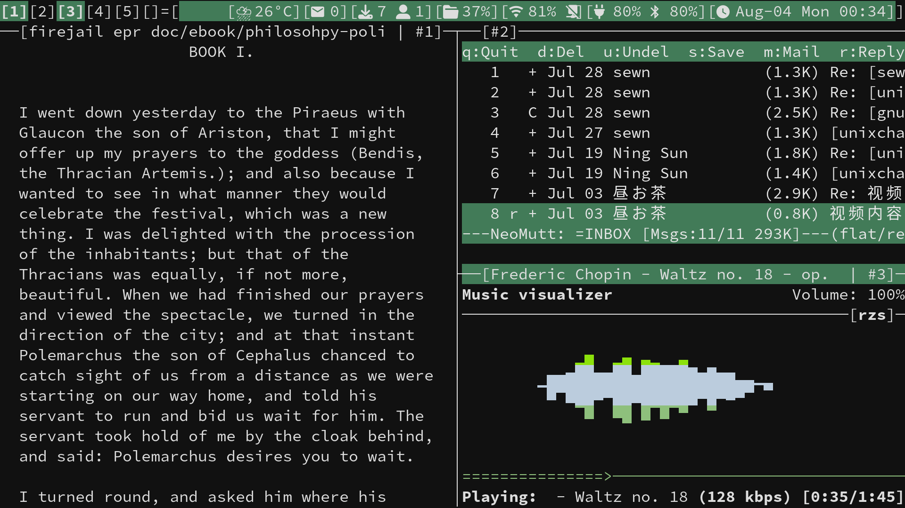

#  My build of [dvtm](https://github.com/martanne/dvtm) - dynamic virtual terminal manager

[dvtm](https://www.brain-dump.org/projects/dvtm/) brings the concept
of tiling window management, popularized by X11-window managers like
[dwm](https://dwm.suckless.org) to the console. As a console window
manager it tries to make it easy to work with multiple console based
programs.



## Statusbar
dvtm can read a named pipe and display it in the statusbar.
```sh
mkfifo $XDG_RUNTIME_DIR/dvtm.fifo
${HOME}/.local/bin/dvtmblocks > $XDG_RUNTIME_DIR/dvtm.fifo
dvtm -s $XDG_RUNTIME_DIR/dvtm.fifo
```
[dvtmblocks](./dvtmblocks), my fork of [sbar](https://github.com/pystardust/sbar)
with the features of:
* Modules update with variable timing.
* Signalling to update modules when needed.

## Patches applied

 - [pertag](./patches/dvtm-v0.15-52-g7bcf43f-pertag.diff)([Originally from](http://waxandwane.org/dvtm.html))

## Session management
My build of abduco([codeberg](https://codeberg.org/unixchad/abduco) or
[github](https://github.com/gnuunixchad/abduco))

## License

dvtm reuses some code of dwm and is released under the same
[MIT/X11 license](https://raw.githubusercontent.com/martanne/dvtm/master/LICENSE).
The terminal emulation part is licensed under the ISC license.
